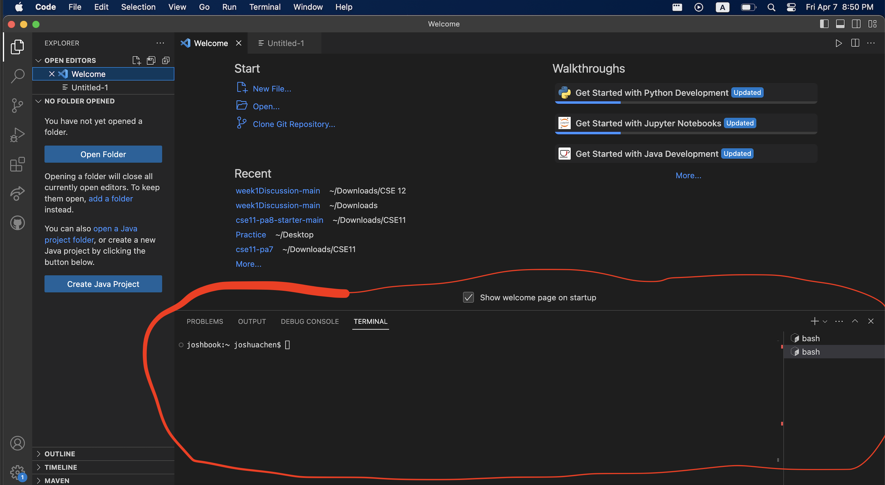
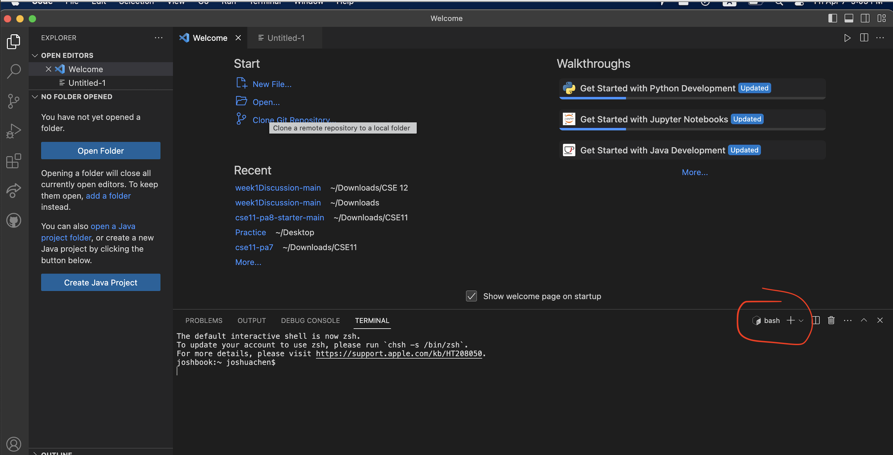

# **Lab Report 1 - Remote Access and FileSystem (Week 1)**

## Let's Get Started! 

**Part 1 - Create CSE15L Account** 
1. Log into your account using [this](https://sdacs.ucsd.edu/~icc/index.php) link and your USCD account info.
2. Press on the button that starts with cs15l

3. Press "Global Password Change Tool"
4. Press "Proceed to the Password Change Tool" 
5. Scroll down, and for username, enter the letters on the box in step 2 (should start with cs15l)
6. Sign in and they'll send an link to your school email to reset the password. 

**Part 2 - Visual Studio Code** 
1. Press [this](https://code.visualstudio.com/) link and follow the instructions to download Visual Studio Code 
2. After following the instructions, first window should look something like this 

3. This is where you'll do most of you coding but for today, we'll just be linking your account 

**Part 3 - Remotely Connecting**
1. Press ```Command```(Mac) or ```Ctrl```(Windows) + ```Shift``` + ```P``` 
2. Type in: ```Terminal: Select Default Profile``` into the search bar 
3. Press ```bash``` profile 
4. Locate the terminal button on the top and press "New Terminal" 

5. After pressing ``` Terminal ``` and  ``` New Terminal ```, a black box should pop up on the bottom 
 
5. To make sure you're on the right track, the right of the terminal should say ```bash```

6. In the terminal, type ```ssh <username from Part 1 step 5>@ieng6.ucsd.edu```
7. Enter the password you made from Part 1 (you won't see anything so really focus and don't make typos:) )
After a couple seconds, you'll be prompted with a message that might look like 

```ssh cs15lsp23zz@ieng6.ucsd.edu The authenticity of host 'ieng6.ucsd.edu (128.54.70.227)' can't be established. RSA key fingerprint is SHA256:ksruYwhnYH+sySHnHAtLUHngrPEyZTDl/1x99wUQcec. Are you sure you want to continue connecting (yes/no/[fingerprint])?```

**Type yes**

9. Your screen should look something like this 

This means that you were successful

**Part 5 – Run Some Commands**
Try running some of these commands in the terminal!
* ```cd```
* ```cd ~ ```
* ```ls -lat```
* ```ls -a```
* ```ls <directory>```, directory is ```/home/linux/ieng6/cs15lsp23/cs15lsp23abc``` where ```abc``` is one of the other group members' username 
* ```cat /home/linux/ieng6/cs15lsp23/public/hello.txt```

This is what mines looks like 


*When you're done, type exit to log out* 


