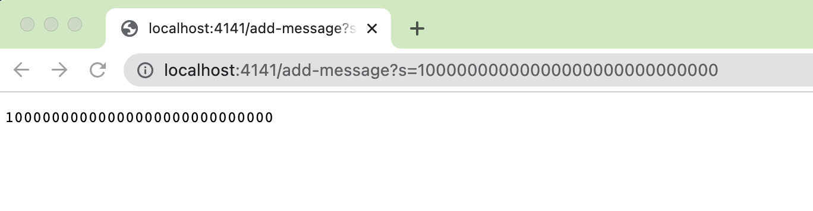

# **Lab Report 2 - Servers and Bugs (Week 3)** #


## Part 1 ##

**Code**


First Call:

- new ArrayList<String> s is created on line 10 with no values inside. 
- String ```result``` is empty 
- ```.getPath()``` used with ```.equals()``` with argument "/add-message" to check if the url contains the string "/add-message" in its path
- ```getQuery()``` is called with ```.split()```. ```getQuery()``` returns a new String with all characters after the "?". From
  there, ```.split()``` is passed with "=" to create the array {"s", "10000000000000000000000000000"}.
- ```.add()``` is called to ```ArrayList s``` with argument "parameters[1]" or "10000000000000000000000000000" 
- ```ArrayList s``` now looks like {"10000000000000000000000000000"}
- a for loop concatenates all the elements of ```ArrayList s``` to ```results. 
- The 10000000000000000000000000000 is casted into a String once you type it into the URL 
- Other than that, no other values are changed. Argument ```URI url``` isn't changed because new variables are created based off the argument. 


  
  
**Second Call:**

- ```ArrayList s``` looks like {"10000000000000000000000000000"} since it was created outside the method
- String ```result``` is empty because the method is called once again 
- ```.getPath()``` used with ```.equals()``` with argument "/add-message" to check if the url contains the string "/add-message" in its path
- ```getQuery()``` is passed with ```.split()```. ```getQuery()``` returns a new String with all characters after the "?". From
  there, ```.split()``` is passed with "=" to create the parameter array {"s", "bye-bye"}.
- ```.add()``` is called to ```ArrayList s``` with argument "parameters[1]" or "bye-bye" 
- ```ArrayList s``` now looks like {"10000000000000000000000000000", "bye-bye}
- a for loop concatenates all the elements of ```ArrayList s``` to ```results```. 
- No values are changed. Argument ```URI url``` isn't changed because new variables are created based off the argument. 
  
--- 
## Part 2 ##
  
Code: 

  
**Failure**-inducing input:
```
  @Test
  public void testReversed2(){
    int[] input = {1,2,3};
    assertArrayEquals(new int[]{3,2,1}, ArrayExamples.reversed(input));
  }
```
  
  
**Non** failure-inducing input:
  
```
  @Test
  public void testReversed2(){
    int[] input = {0};
    assertArrayEquals(new int[]{0}, ArrayExamples.reversed(input));
  }
```
  
Symptom: 

When I created ```int[] newArray```, depsite the length, all elements in the int[] were initialized to 0. The reason that the array is return 0 is because in line 21, ```arr[i] = newArray[arr.length - i - 1];```. This basically sets all elements in arr[] = 0, so it returned 0 instead of 3. 
 
Before: 
```
    static int[] reversed(int[] arr) {
    int[] newArray = new int[arr.length];
    for(int i = 0; i < arr.length; i += 1) {
      arr[i] = newArray[arr.length - i - 1];
    }
    return arr;
  }
```
After: 
```
    static int[] reversed(int[] arr) {
    int[] newArray = new int[arr.length];
    for(int i = 0; i < arr.length; i += 1) {
      newArray[i] = arr[arr.length - i - 1];
    }
    return newArray;
  }
```
  
I just changed the references on line 4 for the block of code. Now, the values of ```newArray``` will be correctly changed to the values of ```arr``` in reversed order. Also, I need to return ```newArray``` not ```arr``` because ```newArray``` is the code in reverse order. 
  
 --- 
  
  ## Part 3 ##
  
  In lab 2, I learned the basics on how to create your own server and update the page. I learned that you were able to run a server on your local computer's host and create basic methods/functions based on the messages you enter on the path. For example, "add-message" and "s=<String>" (which helps to keep return strings enetered that contain a specific String). It was interesting to see how the user can interact with a webpage on a very surface level. 

  

  
  
  
