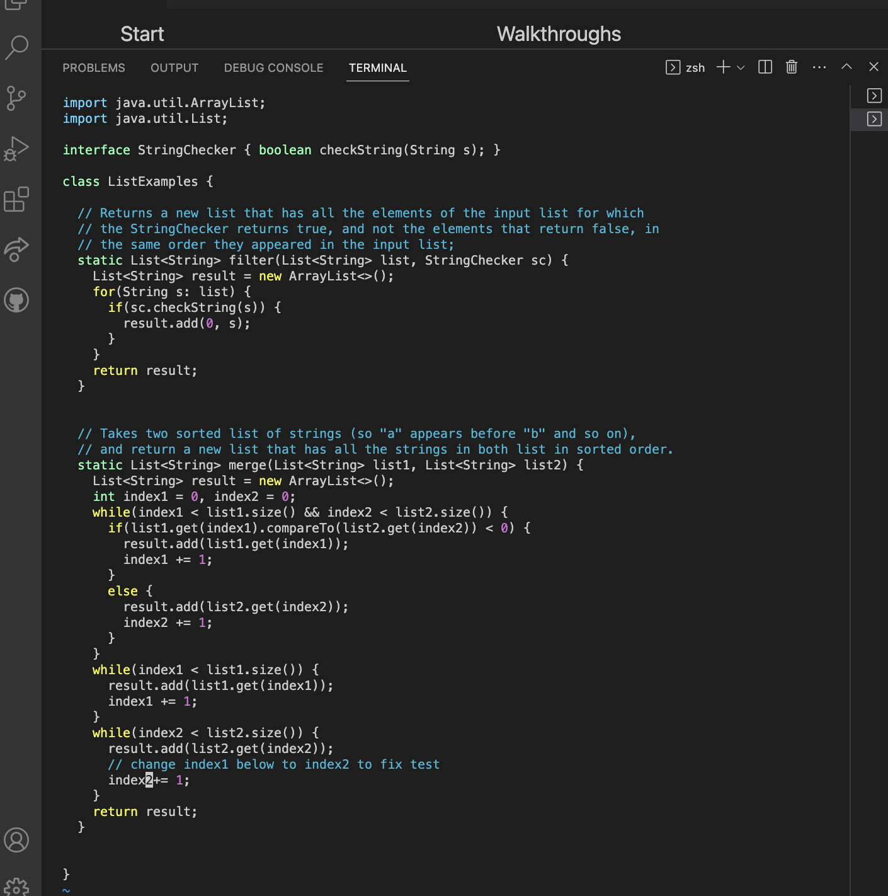
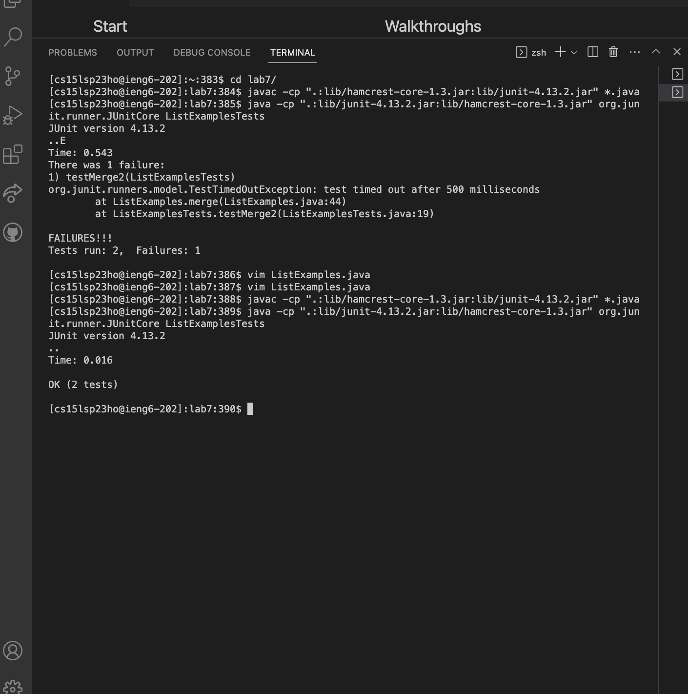
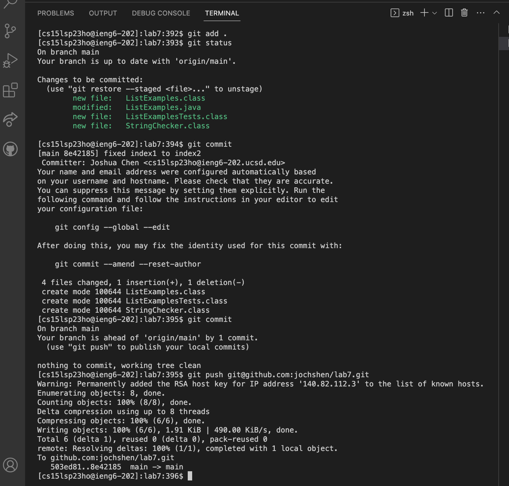
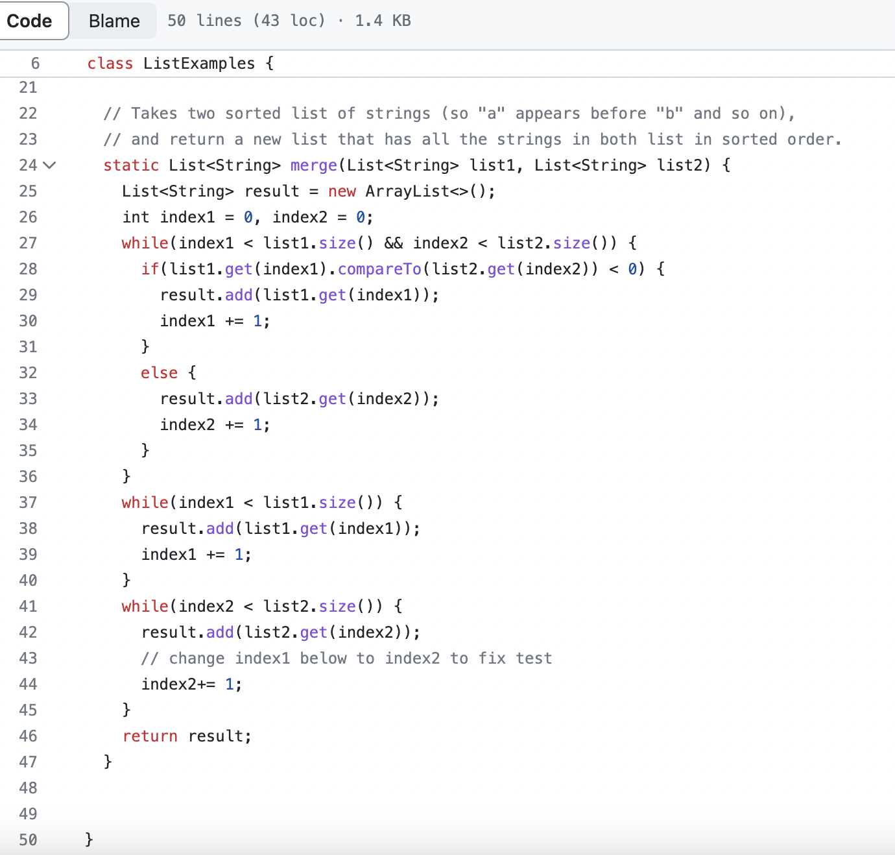

# Lab Report 4 #

*Steps 1-3 already completed*

4. Log into ieng6 

Keystrokes: 

- `ssh cs15lsp23ho@ieng6.ucsd.edu <enter>` *ssh into remote account*

5. Clone the Lab7 Repository 

Keystrokes: 

- `git clone https://github.com/ucsd-cse15l-s23/lab7 <enter>`.
*I typed `ls <enter>` to make sure it succesfully cloned*

6. Run the tests

Keystrokes: 

- `CD Lab 7/` 
- `javac -cp ".:lib/hamcrest-core-1.3.jar:lib/junit-4.13.2.jar" *.java`
-  `java -cp ".:lib/junit-4.13.2.jar:lib/hamcrest-core-1.3.jar" org.junit.runner.JUnitCore 
ListExamplesTests`

*As expected, there is an error and it fails one case* 

7. Edit file in Vim 

Keystrokes:

- `vim ListExmaples` *open ListExamples in vim*

- `/x1 9n <enter>`   ***x1** looks through file for words that contain "x1" and **9n** goes to the 9th instance*

- `a` *to enter insert mode*

- `<backspace> 2` *changes "index1" to "index2"*

- `<escape> :wq` *saves file* 

8. Rerun tests to show that it worked 

*As expected, the tests now pass*

Keystrokes:

- `<up><up><up><up><enter>` *the `javac -cp .:lib/hamcrest-core-1.3.jar:lib/junit-4.13.2.jar *.java` command was 4 spaces up in my history*

-  `<up><up><up><up><enter>` *the `java -cp ".:lib/junit-4.13.2.jar:lib/hamcrest-core-1.3.jar" org.junit.runner.JUnitCore ListExamplesTests` command was also 4 spaces up in my history*

9. Commit and push the changes to Github Account 

Keystrokes:

- `git add.` *adds changes*

- `git commit` *prompts you to a new commit file in vim that I didn't screenshot*

    *in vim commit file*

  - `a` *enter insert mode in vim`
 
  - `Fixed index1 to index2` *commit message at the top*

  - `<escape> :wq` *saves commit message file* 

  *exits vim commit file*
 
 - `git push git@github.com:jochshen/lab7.git` *pushes changes to ssh link*
 
 

**file was updated succesfully**

