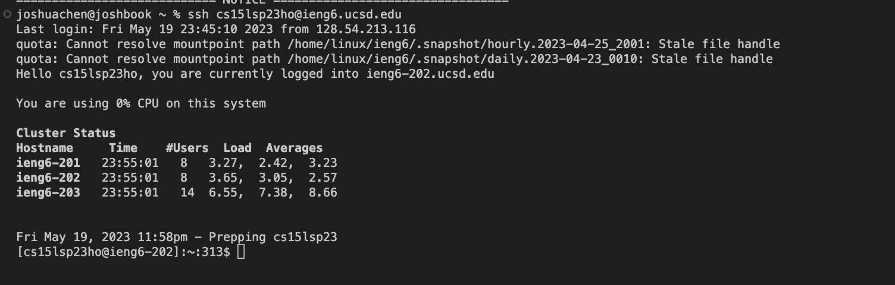
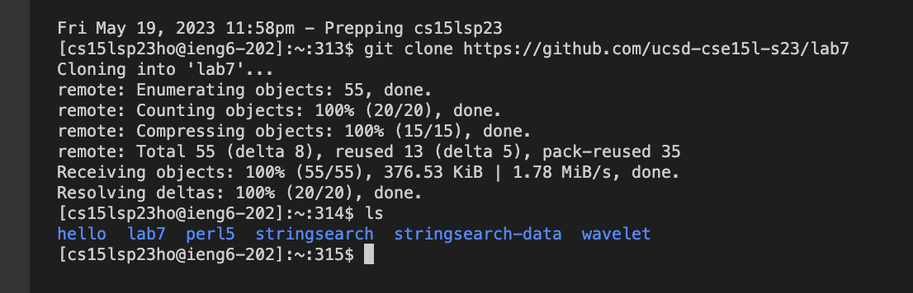
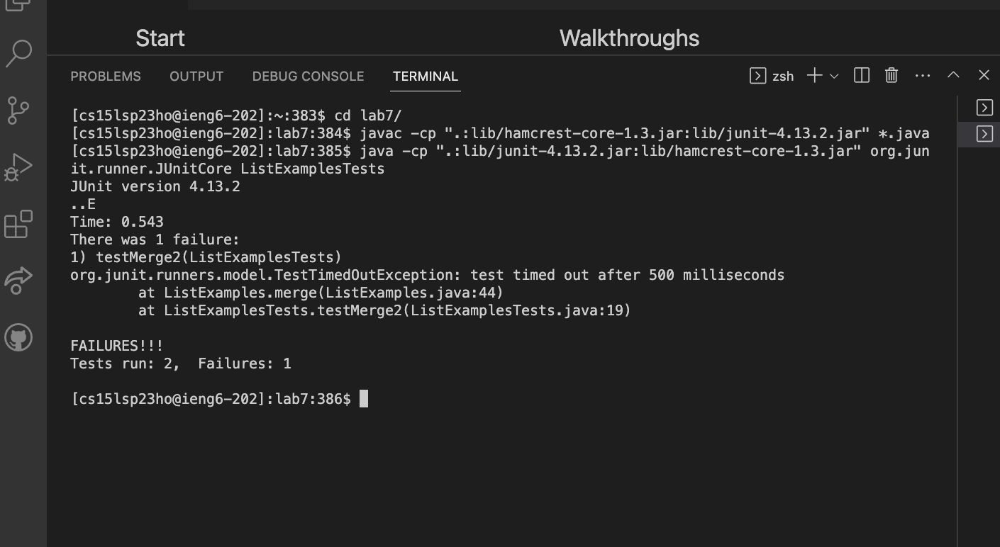

# Lab Report 4 #

*Steps 1-3 already completed*

4. Log into ieng6 

Keystrokes: 
`ssh cs15lsp23ho@ieng6.ucsd.edu <enter>`

5. Clone the Lab7 Repository 

Keystrokes: 
`git clone https://github.com/ucsd-cse15l-s23/lab7 <enter>`.
*I typed `ls <enter>` to make sure it succesfully cloned*

6. Run the tests

Keystrokes: 
`CD Lab 7/`, `javac -cp ".:lib/hamcrest-core-1.3.jar:lib/junit-4.13.2.jar" *.java`, 
`java -cp ".:lib/junit-4.13.2.jar:lib/hamcrest-core-1.3.jar" org.junit.runner.JUnitCore 
ListExamplesTests`
*As expected, there is an error and it fails one case* 

7. Edit file in Vim 

