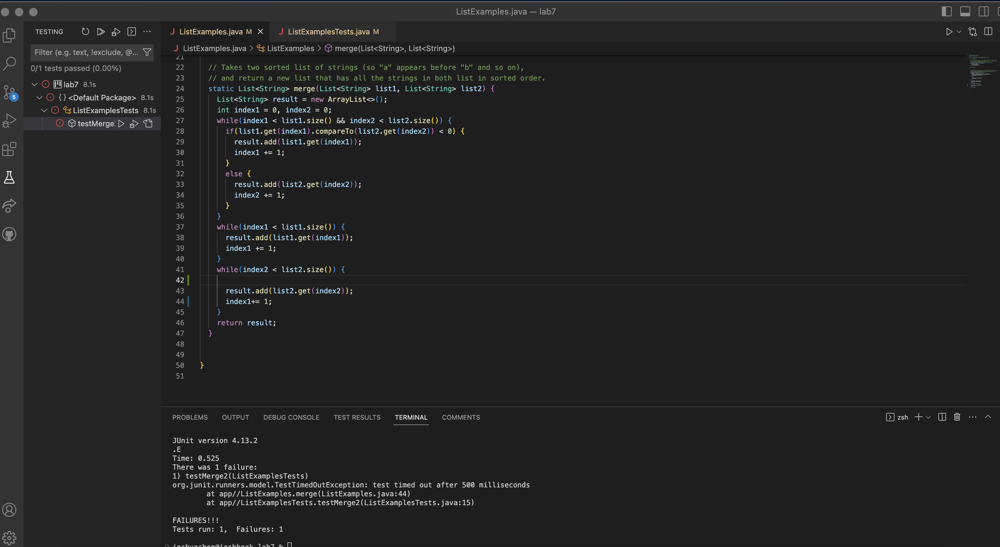
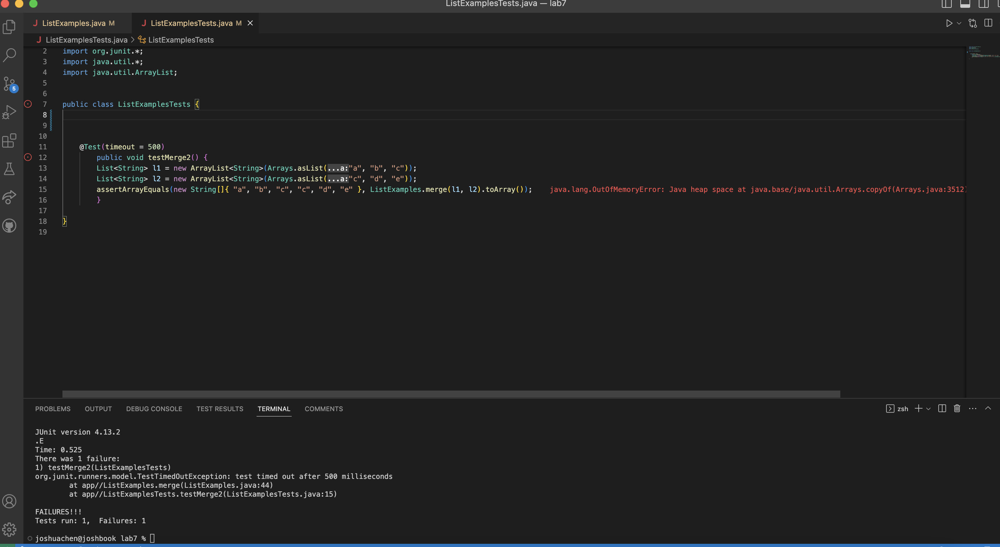
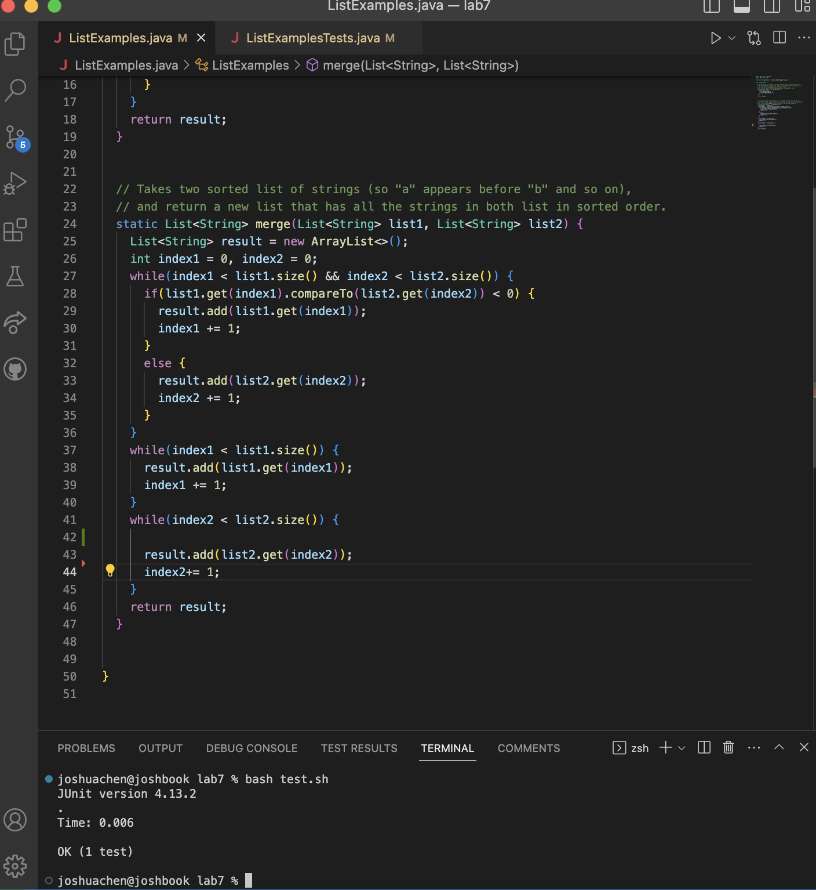
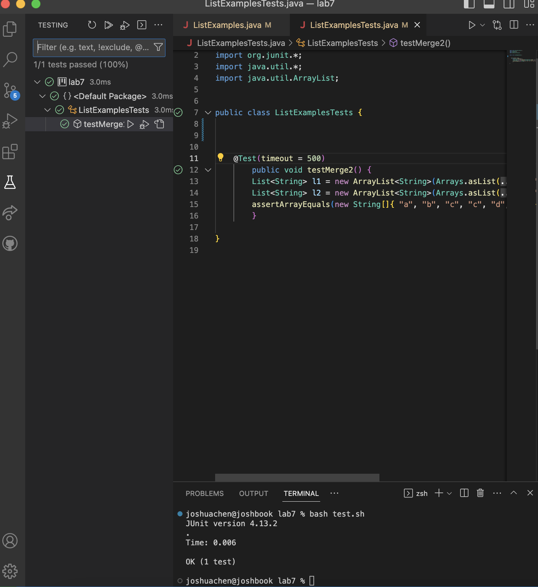

## Lab Report 5 ##


**What environment are you using (computer, operating system, web browser, terminal/editor, and so on)?**
I am on a Macbook Pro with an M1 chip. I am using google chrome and my editor is VS Code. 


**Detail the symptom you're seeing. Be specific; include both what you're seeing and what you expected to see instead. Screenshots are great, copy-pasted terminal output is also great. Avoid saying “it doesn't work”.**

*It says that the test timed out after 500 milliseconds. This means the code wasn't able to execute under an expected time and faced a bug. I'm expecting to see tests pass. Originally, the method is supposed to combine or merge elements from two arrays in order (from smallest to largest). The assertArrayEquals tests for this case but apparently something went wrong!!!*


**Detail the failure-inducing input and context. That might mean any or all of the command you're running, a test case, command-line arguments, working directory, even the last few commands you ran. Do your best to provide as much context as you can.**

*This is the JUnit message.*

*This is my code for the method*

```

static List<String> merge(List<String> list1, List<String> list2) {
    List<String> result = new ArrayList<>();
    int index1 = 0, index2 = 0;
    while(index1 < list1.size() && index2 < list2.size()) {
      if(list1.get(index1).compareTo(list2.get(index2)) < 0) {
        result.add(list1.get(index1));
        index1 += 1;
      }
      else {
        result.add(list2.get(index2));
        index2 += 1;
      }
    }
    while(index1 < list1.size()) {
      result.add(list1.get(index1));
      index1 += 1;
    }
    while(index2 < list2.size()) {
      
      result.add(list2.get(index2));
**line 44**      index1+= 1;
    }
    return result;
  }
```


*It says that there is no heap space. There message also says error on line 44 but I'm not sure what the problem is.*

**TA RESPONSE**

Hi Josh, after looking at your code it seems that the heap may run out of space because one of your while loops never turns to false and keeps running. This can explain why you heap may run out of space and why your test timed out after 500 milliseconds, because the while loop will keep excuting. If you look at line 44, you set `index1 += 1` but your while condition is ` while (index2 < list2.size()`. Your `index2` is never iterated so the while condition remains true and the body keeps executing. Try changing `index1+= 1;` to `index2 += 1` to correctly interate your `index2`. 


**Student Response**

*It worked!*




